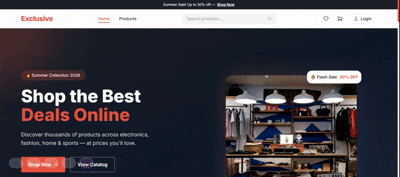
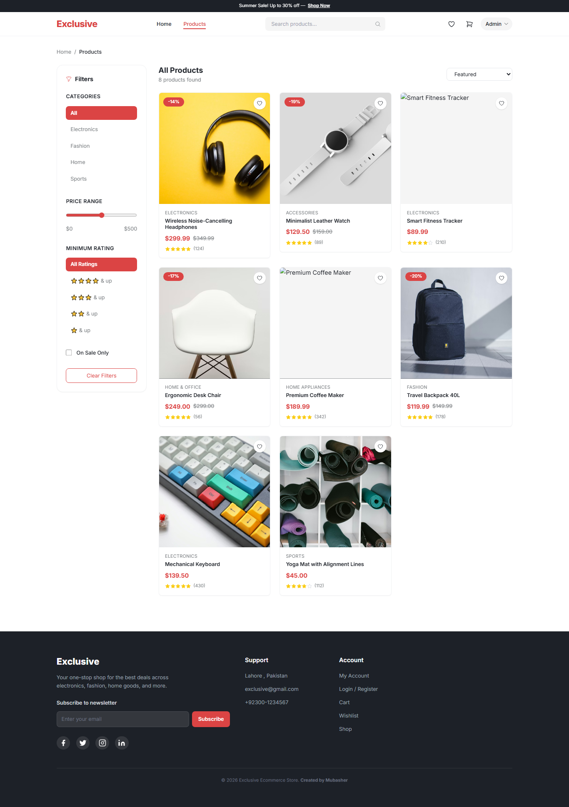
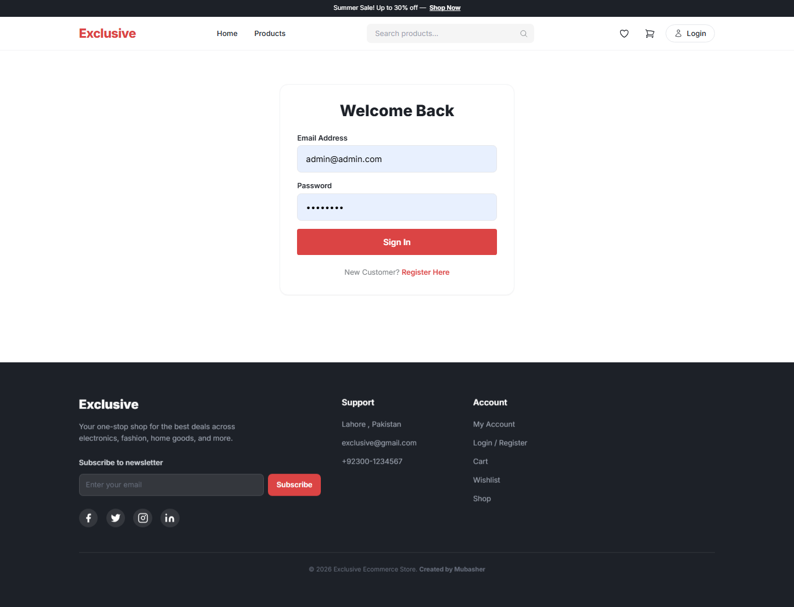
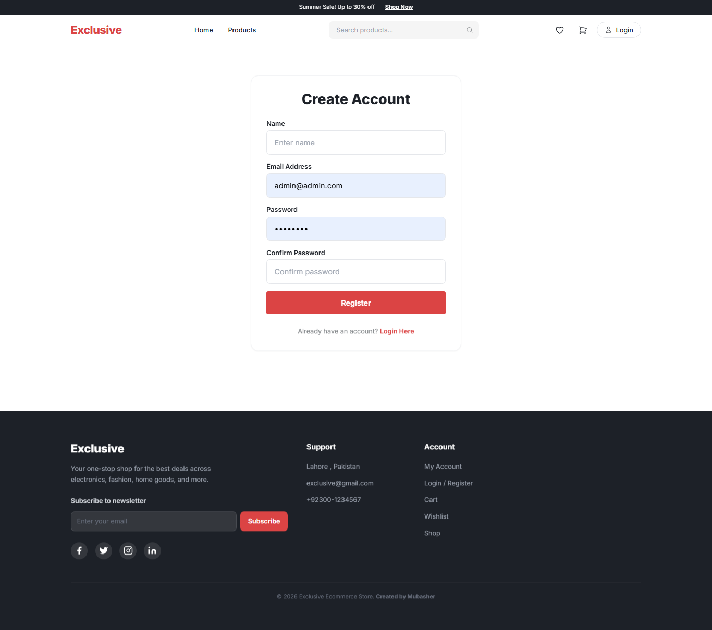
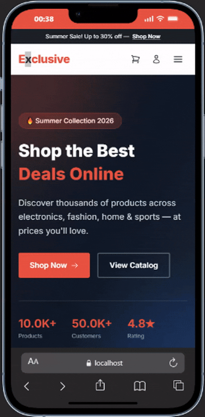
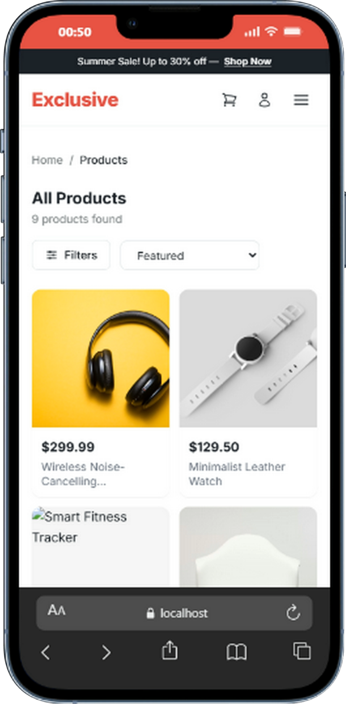
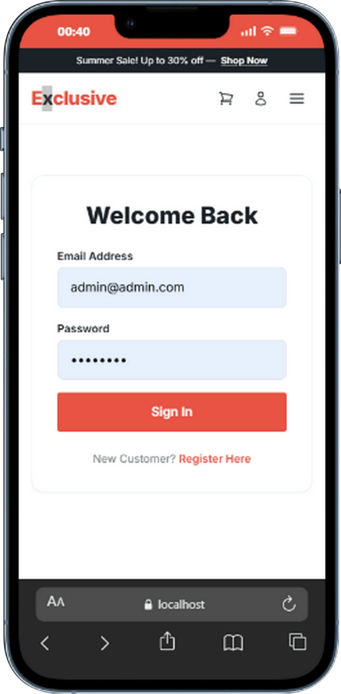
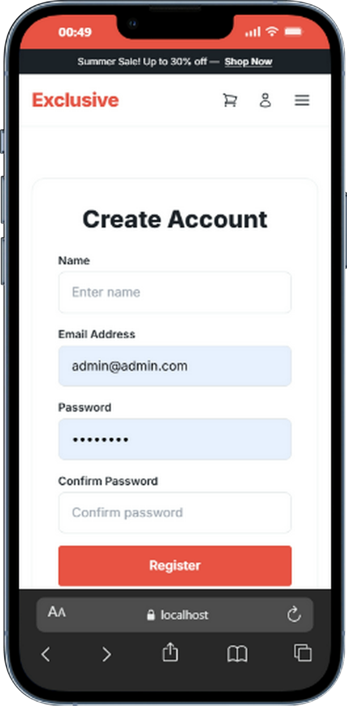

# Exclusive — FullStack E-Commerce Store 

<div align="center">


**A modern full-stack e-commerce web app built with the MERN Stack**

</div>

---

## Tech Stack

| Layer | Technology |
|-------|------------|
| Frontend | React 19, Vite, Tailwind CSS, React Router DOM |
| Backend | Node.js, Express.js, MongoDB, Mongoose |
| Auth | JWT, bcryptjs |
| UI | Heroicons, Recharts, Axios |

---

## 📸 Screenshots

### 🖥️ Desktop Version

<table>
  <tr>
    <td align="center"><b>Home</b></td>
    <td align="center"><b>Product Page</b></td>
    <td align="center"><b>Product Detail</b></td>
  </tr>
  <tr>
    <td></td>
    <td></td>
    <td></td>
  </tr>
  <tr>
    <td align="center"><b>Cart</b></td>
    <td align="center"><b>Login</b></td>
    <td align="center"><b>Register</b></td>
  </tr>
  <tr>
    <td></td>
    <td></td>
    <td></td>
  </tr>
</table>

---

### 👨‍💼 Admin Panel

<table>
  <tr>
    <td align="center"><b>Dashboard</b></td>
    <td align="center"><b>Products</b></td>
  </tr>
  <tr>
    <td></td>
    <td></td>
  </tr>
  <tr>
    <td align="center"><b>Categories</b></td>
    <td align="center"><b>Orders</b></td>
  </tr>
  <tr>
    <td></td>
    <td></td>
  </tr>
</table>

---

### 📱 Mobile Version

<table>
  <tr>
    <td align="center"><b>Home</b></td>
    <td align="center"><b>Products</b></td>
  </tr>
  <tr>
    <td></td>
    <td></td>
  </tr>
  <tr>
    <td align="center"><b>Login</b></td>
    <td align="center"><b>Register</b></td>
  </tr>
  <tr>
    <td></td>
    <td></td>
  </tr>
</table>

---

## 🚀 Quick Start

```bash
# Install dependencies
npm install

# Start backend (port 5000)
npm start

# Start frontend (port 5173)
cd frontend && npm run dev

# Seed sample data
npm run data:import
```

---

## 📋 Pages & Features

| Page | Description |
|------|-------------|
| 🏠 **Home** | Hero banner with animated stats, category carousel, featured products, flash sale countdown, FAQ, newsletter |
| 📦 **Products** | Catalog with filters (category, price, rating), sort options, search, discount toggle |
| 📄 **Product Detail** | Image gallery, stock status, color selector, quantity controls, add to cart, related products |
| 🛒 **Cart** | Item management, quantity adjust, coupon codes (SAVE10), price breakdown |
| 🔐 **Auth** | Login & register with validation, JWT session, protected routes |
| 👤 **Profile** | User avatar, account info, order history link |
| 📋 **Orders** | Order list with status badges, delivery tracking |

---

## 👨‍💼 Admin Panel

| Page | Features |
|------|----------|
| 📊 **Dashboard** | Revenue KPIs, 7-day chart, recent orders |
| 📦 **Products** | Full CRUD — image, name, description, category, price, stock |
| 📂 **Categories** | Add, edit, delete (protected if products exist) |
| 🚚 **Orders** | View details, mark as delivered |

---

## ✨ Features

- ✅ Product browsing with filters, search & sorting
- ✅ Shopping cart with quantity adjust & coupon codes
- ✅ User authentication with JWT
- ✅ Order placement & history tracking
- ✅ Admin dashboard with analytics
- ✅ Full CRUD for products, categories & orders
- ✅ Responsive design (mobile & desktop)
- ✅ Dynamic data from MongoDB

---

## ⚙️ Environment Setup

Create `backend/.env`:

```env
PORT=5000
MONGO_URI=mongodb+srv://<user>:<pass>@<cluster>.mongodb.net/ecomm
JWT_SECRET=your-secret-key
NODE_ENV=development
```

---

## 👤 Default Users

| Role | Email | Password |
|------|-------|----------|
| Admin | admin@example.com | password123 |
| User | self | self  |

---

<div align="center">

**Developed By Mubasher ❤**

</div>
